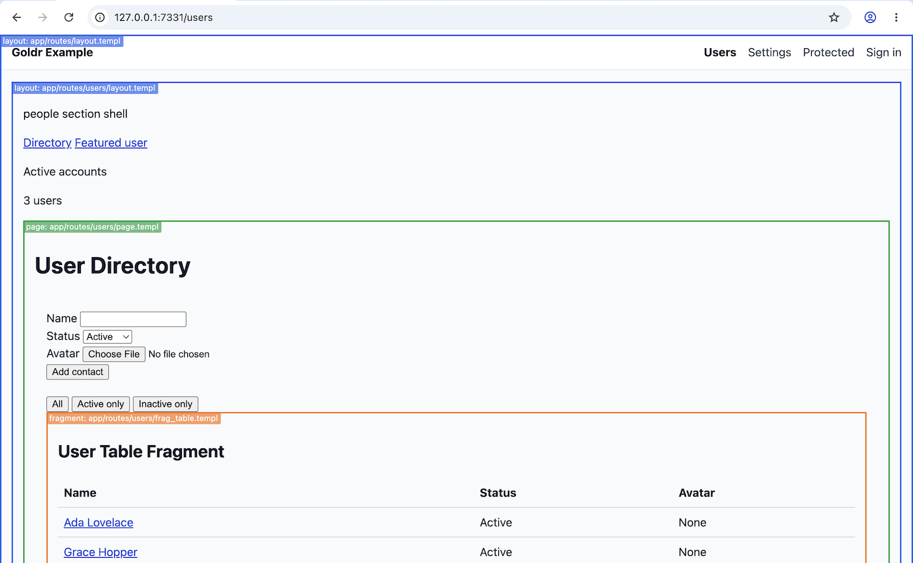

# Template Inspection

Template inspection is a development-only way to see which Goldr render unit
produced a page region.

It is off by default. Normal `routes.Handler()` output does not include
inspector comments, overlay scripts, or debug elements.



## Inspection Modes

Generated route packages expose:

```go
type HandlerOptions struct {
	ErrorHandlers       ErrorHandlers
	TemplateInspection goldr.TemplateInspectionMode
}
```

The supported modes are:

- `goldr.TemplateInspectionOff`: no template inspection.
- `goldr.TemplateInspectionComments`: HTML comment markers only.
- `goldr.TemplateInspectionOverlay`: HTML comment markers plus Goldr's browser
  overlay helper when the layout renders `goldr.TemplateInspector()`.

Goldr does not read environment variables by itself. If you want an env var for
local development, keep that mapping in application code.

## Comment Inspection

Use comments mode when you want DevTools or View Source to show render
boundaries without adding a visible overlay:

```go
import "github.com/mobiletoly/goldr"

mux.Handle("/", routes.HandlerWithOptions(routes.HandlerOptions{
	TemplateInspection: goldr.TemplateInspectionComments,
}))
```

Generated dispatch emits paired HTML comments around page, layout, and
fragment render boundaries:

```html
<!--goldr:start id=g_pageusers_page_templ kind=page route=/users source=app/routes/users/page.templ go=app/routes/users/route.go-->
...
<!--goldr:end id=g_pageusers_page_templ-->
```

The paths are app-relative, never absolute machine paths. `source` is the file
shown and copied by the browser overlay. It prefers the colocated template file
when Goldr can identify one, such as `page.templ` or `layout.templ`; otherwise
it falls back to the Go source file. `go` is the route declaration or handler
file that Goldr calls. Redirect, text, error, and `HEAD` response bodies do not
emit inspector markers.

## Overlay Inspection

Use overlay mode when you want visible outlines and labels in the browser.

Mount Goldr's browser helper and set the generated handler option:

```go
package main

import (
	"net/http"

	"myapp/app/routes"

	"github.com/mobiletoly/goldr"
	"github.com/mobiletoly/goldr/browser"
)

func handler() http.Handler {
	mux := http.NewServeMux()
	mux.Handle("/goldr/", http.StripPrefix("/goldr/", browser.Handler()))
	mux.Handle("/", routes.HandlerWithOptions(routes.HandlerOptions{
		TemplateInspection: goldr.TemplateInspectionOverlay,
	}))
	return mux
}
```

Render the layout helper explicitly, usually near the end of the root layout:

```templ
<body>
	@child
	@goldr.TemplateInspector()
</body>
```

`goldr.TemplateInspector()` renders nothing in off or comments mode. In overlay
mode, it renders a script tag for `/goldr/goldr-template-inspector.js`, the
helper file named by `browser.TemplateInspectorHelperPath`.

The browser helper reads the inspector comments and draws colored outlines and
labels over layout, page, and fragment regions. It appends debug overlay nodes
outside application render regions and does not wrap app content.

The helper also adds a small floating control for the current page:

- `All` shows every visible render-unit boundary.
- `Next` starts one-at-a-time inspection from the outermost visible render
  unit, then advances through visible render units and wraps when it reaches
  the end.
- `Off` hides overlay boxes and labels while keeping the control visible.

The helper stores only `All` and `Off` in `localStorage`. One-at-a-time
inspection is temporary: if you use `Next`, Goldr stores that as `All`, so a
reload returns to the all-boundaries view. Pages rendered with
`TemplateInspectionOff` or `TemplateInspectionComments` do not load the overlay
helper, so there is no runtime control to show.

## Env Var Example

An application can choose inspection mode from an env var during local
development:

```go
func templateInspectionMode() goldr.TemplateInspectionMode {
	switch os.Getenv("GOLDR_TEMPLATE_INSPECTION") {
	case "comments":
		return goldr.TemplateInspectionComments
	case "overlay":
		return goldr.TemplateInspectionOverlay
	default:
		return goldr.TemplateInspectionOff
	}
}
```

Then pass the mode to the generated handler:

```go
mux.Handle("/", routes.HandlerWithOptions(routes.HandlerOptions{
	TemplateInspection: templateInspectionMode(),
}))
```

Run locally with the mode you want:

```bash
GOLDR_TEMPLATE_INSPECTION=comments go run .
GOLDR_TEMPLATE_INSPECTION=overlay go run .
```

`GOLDR_TEMPLATE_INSPECTION` is only the env var used by these examples. You can
choose another name, use flags, or wire the mode directly.

## Embedded Fragments

Generated dispatch marks direct page, layout, and fragment route responses
automatically. When a page embeds a first-class fragment, use the generated
package-local wrapper for that fragment:

```templ
<div id="users-table-slot">
	@renderFragTable(FragTableView(contacts))
</div>
```

For HTMX refreshes, target the slot with `innerHTML`:

```templ
<button
	hx-get={ urls.Users.Table.Path() }
	hx-target="#users-table-slot"
	hx-swap="innerHTML"
>
	Load users
</button>
```

The inspector boundary comments are siblings of the rendered fragment root. A
slot keeps those comments inside the HTMX replacement boundary, so repeated
swaps do not leave stale inspector comments in the DOM.

For comparison, this still renders the same HTML, but does not add an
inspector boundary around the embedded fragment:

```templ
@FragTableView(contacts)
```

The wrapper name follows the fragment path in `route.go`. For example,
`goldr.FragmentRoute("/table", table)` uses `renderFragTable`. An index
fragment uses `renderFragIndex`. Hyphenated fragment paths are normalized to
valid Go identifiers, so `/daytempo-chart` uses `renderFragDaytempoChart`.
When several mounted fragments in the same route package would otherwise share
the same wrapper name, Goldr generates route-qualified wrapper names such as
`renderFragMountCustomerChartIndex`. The helper takes the component you
already render, so the application still chooses the templ function and
arguments.

Multiple templ declarations inside one fragment template are internal to that
fragment render unit. Declare separate fragments in `route.go` when they need
separately inspectable fragment identities.
